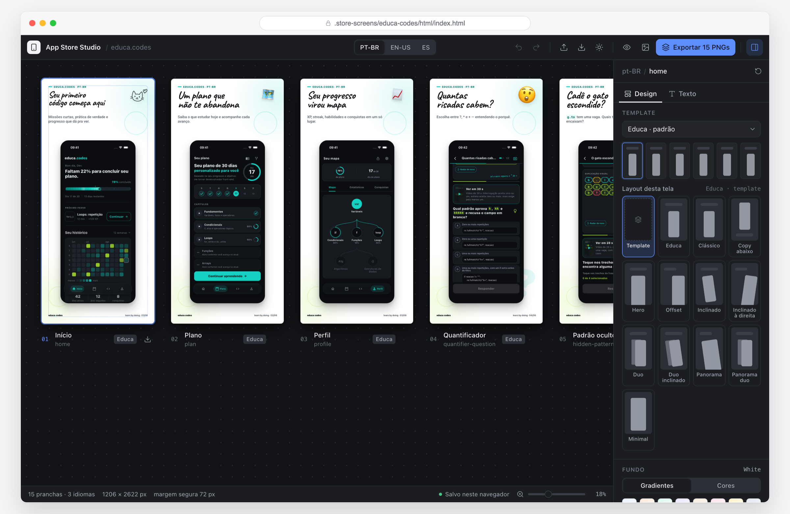

# App Store Screenshots Skill

An agent skill for Claude Code, Claude Desktop and Codex that captures real iOS Simulator screens in several locales and composes App Store screenshots in Figma, Sketch, or a browser-native HTML studio.



The workflow deliberately has no Electron app, database, bundled browser or AI runtime:

- Maestro runs a reusable YAML flow against the Simulator and captures the real app UI.
- Figma (or Sketch) stores the editable marketing frames; the HTML studio is the browser-native alternative with PNG export.
- The agent (Claude or Codex) translates copy, discovers navigation flows, coordinates the tools, and verifies the result.

## Files

- [`SKILL.md`](SKILL.md) is a convenient root-level copy for reading and sharing.
- [`.agents/skills/app-store-screenshots/SKILL.md`](.agents/skills/app-store-screenshots/SKILL.md) is the canonical skill; `.claude/skills/` and `plugins/app-store-screenshots/skills/` symlink to it for Claude Code.
- [`.agents/skills/app-store-screenshots/assets/config.yaml`](.agents/skills/app-store-screenshots/assets/config.yaml) is the campaign configuration template.
- [`.agents/skills/app-store-screenshots/assets/copy.yaml`](.agents/skills/app-store-screenshots/assets/copy.yaml) is the localized marketing-copy template.
- [`.agents/skills/app-store-screenshots/references/`](.agents/skills/app-store-screenshots/references/) contains the Maestro, Figma, and campaign guidance.
- [`.agents/skills/app-store-screenshots/scripts/png_inventory.py`](.agents/skills/app-store-screenshots/scripts/png_inventory.py) validates PNG dimensions and hashes.
- [`.agents/skills/app-store-screenshots/assets/editor/`](.agents/skills/app-store-screenshots/assets/editor/) holds the HTML studio design system (`editor.css`, `icons.svg`, `shell.html`); [`references/editor-design.md`](.agents/skills/app-store-screenshots/references/editor-design.md) documents it.
- [`.agents/skills/app-store-screenshots/scripts/bundle_single_file.py`](.agents/skills/app-store-screenshots/scripts/bundle_single_file.py) builds a self-contained editor for claude.ai Artifacts or offline use.

## Install

The canonical skill lives in `.agents/skills/app-store-screenshots/`. Pick the host you use:

### Claude Code (terminal)

- **Inside this repository**: nothing to install. `.claude/skills/app-store-screenshots` is a symlink to the skill and is discovered automatically.
- **In any other project**, install the plugin from this repository's marketplace:

  ```bash
  claude plugin marketplace add andermelo/app-store-screenshots   # or the local path of this checkout
  claude plugin install app-store-screenshots@ander-ai
  ```

- **As a personal skill** for every project, without the plugin:

  ```bash
  ln -s "$(pwd)/.agents/skills/app-store-screenshots" ~/.claude/skills/app-store-screenshots
  ```

### Claude Desktop

Claude Desktop runs local Claude Code sessions on your Mac, which is what this skill needs (Maestro, Xcode and the Simulator live there; cloud sessions cannot run it).

1. Open the project folder in Claude Desktop and start a local session.
2. Press `+` → **Plugins** → **Add plugin**, add the marketplace `andermelo/app-store-screenshots` (or this checkout's path) and install `app-store-screenshots`. Skills already installed in `~/.claude/skills/` also load in local sessions.
3. Type `/` and pick **app-store-screenshots**, or just describe the campaign; the skill triggers on its own.

### Codex

`.agents/skills/` is discovered automatically when you open this repository. For other projects, copy or symlink the skill into your Codex skills directory, or install the plugin exposed by `.agents/plugins/marketplace.json`. Invoke it with `$app-store-screenshots`.

### Prerequisites for every host

Maestro CLI 2.7.0 or newer, Xcode with a booted iOS Simulator, the app installed with deterministic demo data, and for the Figma route the remote Figma MCP connector (`upload_assets`, `use_figma`) plus edit access to the destination file.

## HTML studio and single-file builds

The HTML route ships a design system for the campaign editor (`assets/editor/`) and a bundler that inlines fonts, screenshots and settings into one HTML file:

```bash
python3 .agents/skills/app-store-screenshots/scripts/bundle_single_file.py \
  .store-screens/<campaign>/html/index.html \
  --output .store-screens/<campaign>/html/dist/studio.html --mode standalone
```

`--mode artifact` produces the fragment the claude.ai Artifact tool expects; publish it with the `downloads` capability so PNG export works inside the artifact. The shell uses no CDNs or remote fonts.

## Use

Ask for a campaign in your own words; the skill asks one routing question (Figma, Sketch, or HTML) before composing.

```text
# Claude Code / Claude Desktop
/app-store-screenshots capture o app com.example.app em en-US e pt-BR,
nas cenas home e detail, e componha no HTML studio.

# Codex
$app-store-screenshots capture o app com.example.app em en-US e pt-BR,
nas cenas home e detail, e sincronize no template Figma <URL>.
```

The skill creates project-specific campaign state under `.store-screens/`:

```text
.store-screens/
  config.yaml
  copy.yaml
  flow.yaml
  raw/<locale>/
  exported/<locale>/
  review/
  figma-manifest.json
  STATUS.md
```

Figma templates should expose one unambiguous layer for each role used by the campaign: `@screenshot`, `@headline`, and optionally `@subhead`.

The same Maestro flow can capture every locale. Prefer stable accessibility IDs so navigation does not depend on translated labels. Locale setup happens before the flow because local `maestro test` does not accept `--device-locale`.

The default workflow stops after capture, Figma sync, and visual review. Publishing to App Store Connect requires a separate explicit request.

## Validate the skill

```bash
uv run --with pyyaml python \
  ~/.codex/skills/.system/skill-creator/scripts/quick_validate.py \
  .agents/skills/app-store-screenshots
```

The PNG helper has no third-party runtime dependency:

```bash
python3 .agents/skills/app-store-screenshots/scripts/png_inventory.py \
  .store-screens/raw/pt-BR --expect 2 --same-size
```

## Safety and quality

- Never capture credentials, private messages, production customer data, or secrets.
- Never use an image model to fake the app UI.
- Keep localized marketing text editable in Figma.
- Verify every locale visually, especially long-copy and right-to-left locales.
- Figma writes and App Store publishing occur only when explicitly requested.
